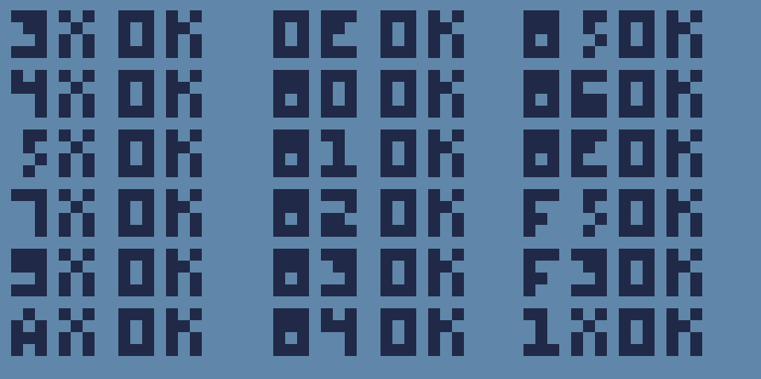

# Chip-8 Emulator
 A simple Chip-8 emulator using OpenGL and C++
 
 ```
                                                        ##        ##
                                                         ##      ##
                                                      ###############
                                                    ####  #######  ####
                                                  #######################
                                                  ##  ###############  ##
                                                  ##  ###############  ##
                                                  ##  ##           ##  ##
                                                        ####   ####
```                               
                    



Emulator speed is much higher than the speed of the gif

### Controls
```
Chip-8Keys    Keyboard
+-+-+-+-+    +-+-+-+-+
|1|2|3|C|    |1|2|3|4|
+-+-+-+-+    +-+-+-+-+
|4|5|6|D|    |Q|W|E|R|
+-+-+-+-+ => +-+-+-+-+
|7|8|9|E|    |A|S|D|F|
+-+-+-+-+    +-+-+-+-+
|A|0|B|F|    |Z|X|C|V|
+-+-+-+-+    +-+-+-+-+
```

## Dependencies 
- [GLFW](https://www.glfw.org/)
- [glad](https://glad.dav1d.de/)

## Build instructions (for Linux)

After installing CMake and the above dependencies, run the following commands in the src directory

```
mkdir build
cd build
cmake ..
make
```

Run:
```
./CHIP-8_Emulator <delay> <pathToROM>
```
